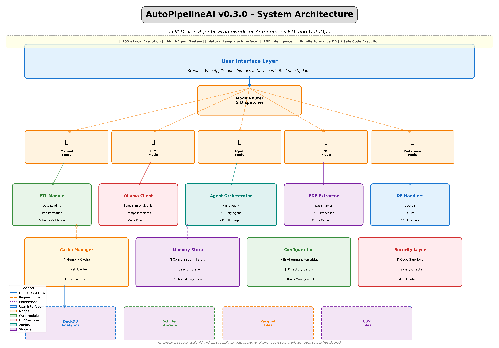

# 📐 Architecture Documentation Files

This directory contains comprehensive architecture documentation for AutoPipelineAI v0.3.0.

---

## 📁 Files Overview

### 1. **architecture_diagram.png** (836 KB)
- **Format:** High-resolution PNG image (300 DPI)
- **Size:** 20" x 14" (print-ready)
- **Use Case:**
  - GitHub README
  - Documentation
  - Presentations
  - Blog posts
  - Social media sharing

**Features:**
- ✅ 6 architectural layers
- ✅ 5 operational modes
- ✅ 10+ core components
- ✅ Color-coded modules
- ✅ Data flow arrows
- ✅ Comprehensive legend
- ✅ Professional styling

---

### 2. **architecture_diagram.pdf** (57 KB)
- **Format:** Vector PDF (scalable)
- **Use Case:**
  - Print documentation
  - Presentations (PowerPoint, Keynote)
  - Academic papers
  - Technical reports

**Advantages:**
- Infinite zoom without quality loss
- Small file size
- Print-ready
- Professional quality

---

### 3. **architecture.puml** (4.3 KB)
- **Format:** PlantUML source code
- **Use Case:**
  - Generate diagrams programmatically
  - Integrate with documentation tools
  - Version control friendly
  - Easy modifications

**How to Use:**
```bash
# Install PlantUML
brew install plantuml

# Generate PNG
plantuml architecture.puml

# Generate SVG
plantuml -tsvg architecture.puml

# Generate PDF
plantuml -tpdf architecture.puml
```

**Online Viewer:**
- https://www.plantuml.com/plantuml/uml/
- Paste the .puml file contents

---

### 4. **ARCHITECTURE.md** (57 KB)
- **Format:** Markdown documentation
- **Use Case:**
  - Detailed technical documentation
  - Developer onboarding
  - Architecture decisions record
  - GitHub wiki

**Contents:**
- 📊 Visual diagram (embedded PNG)
- 🏗️ Layer-by-layer breakdown
- 🔄 Data flow patterns
- 🧩 Component details
- 🔐 Security architecture
- ⚡ Performance optimizations
- 🧪 Testing architecture
- 📈 Scalability considerations
- 🔧 Technology stack
- 🎯 Design decisions

---

### 5. **create_architecture_diagram.py** (15 KB)
- **Format:** Python script
- **Use Case:**
  - Regenerate diagrams
  - Customize colors/layout
  - Add new components
  - Automated documentation

**Usage:**
```bash
python create_architecture_diagram.py
```

**Customization:**
Edit the script to:
- Change colors
- Add new components
- Modify layout
- Update text
- Add annotations

---

## 🎨 How to Use Each Format

### **For GitHub README**
```markdown

```

### **For Documentation Website**
```markdown
# Architecture


For detailed documentation, see [ARCHITECTURE.md](./ARCHITECTURE.md)
```

### **For Presentations**
1. Import `architecture_diagram.pdf` into PowerPoint/Keynote
2. Scales perfectly at any size
3. Maintains quality on large screens

### **For Blog Posts**
1. Use `architecture_diagram.png` for web
2. Optimized size (836 KB)
3. High resolution for retina displays

### **For Technical Papers**
1. Use `architecture_diagram.pdf`
2. Vector format for publication
3. Professional quality

### **For Wiki/Docs**
1. Create a page with `ARCHITECTURE.md` content
2. Embed PNG diagram
3. Link to other documentation

---

## 📐 Diagram Structure

### **Layer 1: User Interface**
- Streamlit web application
- Interactive dashboard
- 5 operational modes

### **Layer 2: Mode Router**
- Request routing
- Mode selection
- Dispatch logic

### **Layer 3: Core Processing**
- ETL Module
- Ollama Client
- Agent Orchestrator
- PDF Extractor
- Database Handlers

### **Layer 4: Support Services**
- Cache Manager
- Memory Store
- Configuration
- Security Layer

### **Layer 5: Data Storage**
- DuckDB (Analytics)
- SQLite (Storage)
- Parquet Files
- CSV Files

---

## 🎨 Color Scheme

| Color | Purpose | Hex Code |
|-------|---------|----------|
| Light Blue | User Interface | #E3F2FD |
| Light Orange | Modes & Router | #FFF3E0 |
| Light Green | Core Modules | #E8F5E9 |
| Light Red | LLM Services | #FFEBEE |
| Light Teal | Agents | #E0F2F1 |
| Light Purple | Storage | #F3E5F5 |

---

## 🔄 Updating the Diagram

### **When to Update**
- Adding new components
- Changing architecture
- New features
- Major refactoring

### **How to Update**

**1. Edit Python Script:**
```bash
# Edit create_architecture_diagram.py
# Add new components, change colors, etc.

# Regenerate
python create_architecture_diagram.py
```

**2. Edit PlantUML:**
```bash
# Edit architecture.puml
# Add/modify components

# Regenerate
plantuml architecture.puml
```

**3. Update Markdown:**
```bash
# Edit ARCHITECTURE.md
# Update descriptions, add sections
```

---

## 📤 Sharing the Architecture

### **In LinkedIn Post**
Use the PNG with your post:
```
Excited to share the architecture of AutoPipelineAI!

[Attach architecture_diagram.png]

Built with 6 layers of modular design...
```

### **In GitHub Issues/PRs**
```markdown
## Architecture Impact

This change affects the following components:


Changes made to:
- ETL Module
- Cache Manager
```

### **In Documentation Sites**
```markdown
# System Architecture


[View detailed architecture documentation →](./ARCHITECTURE.md)
```

---

## 🖼️ Embedding in Different Platforms

### **GitHub**
```markdown

```

### **GitLab**
```markdown

```

### **Notion**
- Upload `architecture_diagram.png`
- Or embed PDF for better quality

### **Confluence**
- Upload PDF for best quality
- Or PNG for web viewing

### **Google Docs**
- Insert → Image → Upload
- Use PDF for best quality

---

## 📊 File Comparison

| Feature | PNG | PDF | PlantUML | Markdown |
|---------|-----|-----|----------|----------|
| Size | 836 KB | 57 KB | 4.3 KB | 57 KB |
| Scalable | ❌ | ✅ | ✅ | N/A |
| Editable | ❌ | ❌ | ✅ | ✅ |
| Web-friendly | ✅ | ⚠️ | ❌ | ✅ |
| Print-ready | ✅ | ✅ | ✅ | ❌ |
| GitHub Preview | ✅ | ✅ | ❌ | ✅ |
| Version Control | ⚠️ | ⚠️ | ✅ | ✅ |

**Legend:**
- ✅ Excellent
- ⚠️ Acceptable
- ❌ Not recommended

---

## 🎯 Best Practices

### **For Version Control**
- ✅ Commit `.puml` and `.md` files
- ✅ Commit generated images (for convenience)
- ✅ Tag major architecture changes
- ⚠️ Large images increase repo size

### **For Documentation**
- ✅ Keep ARCHITECTURE.md up to date
- ✅ Link from main README
- ✅ Include in wiki/docs site
- ✅ Update on major changes

### **For Presentations**
- ✅ Use PDF for slides
- ✅ PNG for web/social media
- ✅ Regenerate at higher DPI if needed

---

## 🔧 Troubleshooting

### **Diagram not showing in GitHub**
- Check file path is correct
- Ensure PNG file is committed
- Use relative path: `./architecture_diagram.png`

### **PlantUML not generating**
```bash
# Install Java (required for PlantUML)
brew install java

# Install PlantUML
brew install plantuml

# Generate diagram
plantuml architecture.puml
```

### **Regenerating with Python**
```bash
# Ensure matplotlib is installed
pip install matplotlib

# Run script
python create_architecture_diagram.py
```

---

## 📚 Additional Resources

### **PlantUML Documentation**
- https://plantuml.com/
- https://plantuml.com/component-diagram

### **Architecture Diagrams Best Practices**
- https://c4model.com/
- https://www.structurizr.com/

### **Markdown Documentation**
- https://www.markdownguide.org/

---

## 📞 Questions?

If you have questions about the architecture:
1. See [ARCHITECTURE.md](./ARCHITECTURE.md) for details
2. Check [README_v0.3.md](./README_v0.3.md) for features
3. Open an issue on GitHub
4. Contact: niteshranjan1996@gmail.com

---

**Files Created:** 2025-11-10
**Version:** 0.3.0
**Author:** Nitesh Ranjan Singh
