<div align="center">

# 🤖 AutoPipelineAI

### **LLM-Driven Agentic Framework for Autonomous ETL and DataOps**

[](https://www.python.org/downloads/)
[](https://streamlit.io/)
[](LICENSE)
[](https://github.com/nitesh0007-edith/AutoPipelineAI)

**Transform your data workflows with AI-powered automation running entirely on your local machine.**

[Features](#-key-features) • [Installation](#-installation) • [Usage](#-usage-guide) • [Documentation](#-documentation) • [Contributing](#-contributing)


</div>

---

## 🌟 Overview

**AutoPipelineAI** is a next-generation open-source framework that combines **Large Language Models (LLMs)**, **autonomous agents**, and **modular ETL pipelines** to automate complex data workflows from ingestion to analysis.

> 💡 **Ask questions in plain English. Upload files. Get data cleaned, analyzed, and visualized — completely autonomously.**

### ✨ What Makes AutoPipelineAI Special?

- 🔒 **100% Local & Private** - No cloud dependencies, your data never leaves your machine
- 🤖 **Multi-Agent System** - Specialized agents work together to handle complex workflows
- 🧠 **Natural Language Interface** - Ask questions in plain English, get actionable insights
- 📄 **Document Intelligence** - Extract data from PDFs with NER capabilities
- 🗄️ **High-Performance Analytics** - DuckDB integration for blazing-fast queries
- 🎨 **Beautiful UI** - Intuitive Streamlit interface with 5 operational modes

---

## 🚀 Key Features

<table>
<tr>
<td width="50%">

### 🎯 Core Capabilities

✅ **Multi-Agent Orchestration**
- ETL Agent for data transformation
- Query Agent for natural language queries
- Profiling Agent for data quality checks
- Intelligent task routing

✅ **LLM Integration**
- Local LLM support via Ollama
- Multiple models (llama3, mistral, phi3)
- Safe code execution sandbox
- Context-aware responses

✅ **Document Processing**
- PDF text & table extraction
- Named Entity Recognition (NER)
- Image extraction from documents
- Metadata extraction

</td>
<td width="50%">

### 🛠️ Advanced Features

✅ **Database Support**
- DuckDB for analytics workloads
- SQLite for lightweight storage
- Direct CSV/Parquet reading
- SQL query interface

✅ **Performance Optimization**
- Memory & disk caching
- Session state management
- Conversation history tracking
- Execution logging

✅ **Developer Experience**
- Configuration via .env files
- Comprehensive test suite
- Type hints & docstrings
- Automated setup script

</td>
</tr>
</table>

---

## 📸 Screenshots

<div align="center">

### 🎮 5 Operational Modes

| Manual Mode | LLM Mode | Agent Mode |
|-------------|----------|------------|
|  |  |  |
| Traditional ETL with filters | Natural language queries | Multi-agent workflows |

| PDF Extraction | Database Mode |
|----------------|---------------|
|  |  |
| Document processing & NER | SQL analytics interface |

</div>

---

## 🏗️ Architecture

```mermaid
graph TB
    User[User Interface - Streamlit] --> Mode{Mode Selection}

    Mode --> Manual[📊 Manual Mode]
    Mode --> LLM[🧠 LLM Mode]
    Mode --> Agent[🤝 Agent Mode]
    Mode --> PDF[📄 PDF Mode]
    Mode --> DB[🗄️ Database Mode]

    Manual --> ETL[ETL Module]
    LLM --> Ollama[Ollama Client]
    Agent --> Orchestrator[Agent Orchestrator]
    PDF --> PDFExtractor[PDF Extractor]
    DB --> DBHandlers[DB Handlers]

    Orchestrator --> ETLAgent[ETL Agent]
    Orchestrator --> QueryAgent[Query Agent]
    Orchestrator --> ProfileAgent[Profile Agent]

    Ollama --> CodeExecutor[Safe Code Executor]
    PDFExtractor --> NER[NER Processor]

    ETL --> Cache[Cache Manager]
    ETLAgent --> Cache
    QueryAgent --> Cache

    Cache --> Memory[Memory Store]

    DBHandlers --> DuckDB[(DuckDB)]
    DBHandlers --> SQLite[(SQLite)]

    style User fill:#e1f5ff
    style Mode fill:#fff3cd
    style Orchestrator fill:#d4edda
    style Cache fill:#f8d7da
```



---

## 💻 Installation

### Prerequisites

- **Python 3.10+**
- **pip** (Python package manager)
- **Git**
- **Ollama** (optional, for LLM features)

### Quick Start (Recommended)

```bash
# Clone the repository
git clone https://github.com/nitesh0007-edith/AutoPipelineAI.git
cd AutoPipelineAI

# Run automated setup
chmod +x setup.sh
./setup.sh

# Activate virtual environment
source venv/bin/activate  # On Windows: venv\Scripts\activate

# Run the enhanced version
streamlit run main_enhanced.py
```

### Manual Installation

```bash
# Create virtual environment
python3 -m venv venv
source venv/bin/activate

# Install dependencies
pip install -r requirements.txt

# Create necessary directories
mkdir -p data/{cache,database,processed,reports,exports}
mkdir -p logs input_docs

# Copy environment template
cp .env.template .env
```

### Optional: Setup Ollama for LLM Features

```bash
# Install Ollama
curl -fsSL https://ollama.ai/install.sh | sh

# Start Ollama server (in a separate terminal)
ollama serve

# Pull models
ollama pull llama3
ollama pull mistral
ollama pull phi3
```

### Optional: Install spaCy Model for NER

```bash
python -m spacy download en_core_web_sm
```

---

## 🎮 Usage Guide

### Access the Application

After running `streamlit run main_enhanced.py`, open your browser to:
- **Local:** http://localhost:8501

### 🎯 Mode 1: Manual Mode

**Perfect for:** Traditional ETL workflows with filters

```
1. Click "Manual Mode" tab
2. Load sample data or upload CSV/Excel
3. Apply date range and region filters
4. Generate profile reports
5. Save to database
```

### 🧠 Mode 2: LLM Mode

**Perfect for:** Natural language data analysis

**Example Questions:**
```
- "What are the top 10 products by sales?"
- "Show total profit by region for 2020"
- "Which category has the highest return rate?"
- "Calculate average discount by segment"
```

### 🤝 Mode 3: Agent Mode

**Perfect for:** Complex multi-step workflows

**Example Workflow:**
```
"Load the sales data, filter for Q4 2023,
 calculate top 10 products by revenue,
 and generate a comprehensive report"
```

### 📄 Mode 4: PDF Extraction

**Perfect for:** Document processing

**Capabilities:**
- Extract text from PDFs
- Extract tables with structure
- Named Entity Recognition (dates, amounts, names)
- Image extraction
- Metadata extraction

### 🗄️ Mode 5: Database

**Perfect for:** SQL analytics

**Features:**
- Run SQL queries on data
- View table schemas
- Aggregate statistics
- High-performance analytics with DuckDB

---

## 🛠️ Tech Stack

| Category | Technologies |
|----------|-------------|
| **Language** | Python 3.10+ |
| **UI Framework** | Streamlit |
| **Data Processing** | Pandas, PyArrow |
| **Data Profiling** | ydata-profiling |
| **LLM Integration** | LangChain, CrewAI, Ollama |
| **Databases** | DuckDB, SQLite |
| **Document Processing** | PyMuPDF, pdfplumber |
| **NER** | spaCy |
| **Caching** | diskcache, Redis |
| **Testing** | pytest |
| **Visualization** | Plotly, Altair |

---

## 📚 Documentation

- **[Quick Start Guide](QUICKSTART.md)** - Get up and running in 5 minutes
- **[Full Documentation](README_v0.3.md)** - Comprehensive feature documentation
- **[Upgrade Summary](UPGRADE_SUMMARY.md)** - What's new in v0.3.0
- **[Configuration Guide](.env.template)** - Environment variables reference

---

## 🧪 Running Tests

```bash
# Run all tests
pytest

# Run with coverage
pytest --cov=src --cov-report=html

# Run specific test file
pytest tests/test_cache.py -v
```

---

## 🗺️ Roadmap

### ✅ Completed (v0.3.0)
- [x] Multi-agent orchestration system
- [x] PDF extraction with NER
- [x] Database support (DuckDB, SQLite)
- [x] Memory and caching layer
- [x] Enhanced UI with 5 modes
- [x] Configuration management
- [x] Unit test suite

### 🔜 Coming Soon (v0.4.0)
- [ ] Docker containerization
- [ ] FastAPI REST endpoints
- [ ] Web scraping capabilities
- [ ] Time series analysis
- [ ] Email report generation
- [ ] Scheduled workflows
- [ ] Enhanced visualizations

---

## 🤝 Contributing

Contributions are welcome! Here's how you can help:

1. **Fork the repository**
2. **Create a feature branch**
   ```bash
   git checkout -b feature/amazing-feature
   ```
3. **Make your changes**
4. **Add tests** for new features
5. **Commit your changes**
   ```bash
   git commit -m "Add amazing feature"
   ```
6. **Push to your fork**
   ```bash
   git push origin feature/amazing-feature
   ```
7. **Open a Pull Request**

### Development Guidelines

- Follow PEP 8 style guide
- Add docstrings to all functions
- Write unit tests for new features
- Update documentation for significant changes
- Use type hints where applicable

---

## 💡 Use Cases

<table>
<tr>
<td width="50%">

### 📊 Business Analytics
- Sales performance analysis
- Customer segmentation
- Revenue forecasting
- KPI dashboards

### 📄 Document Processing
- Invoice data extraction
- Contract analysis
- Report summarization
- Entity extraction

</td>
<td width="50%">

### 🔍 Data Quality
- Automated profiling
- Schema validation
- Outlier detection
- Missing value analysis

### 🤖 Workflow Automation
- ETL pipeline orchestration
- Scheduled data processing
- Multi-source integration
- Report generation

</td>
</tr>
</table>

---

## 🐛 Troubleshooting

### Ollama Connection Issues
```bash
# Check if Ollama is running
curl http://localhost:11434/api/tags

# Start Ollama
ollama serve
```

### Import Errors
```bash
# Reinstall dependencies
pip install --upgrade -r requirements.txt
```

### Permission Issues
```bash
# Fix directory permissions
chmod -R 755 data logs
```

For more help, see [QUICKSTART.md](QUICKSTART.md#-troubleshooting)

---

## 📊 Project Stats

<div align="center">


</div>

---

## 👨‍💻 Author

<div align="center">

**Nitesh Ranjan Singh**

*Analyst (Data Engineer) @ IQVIA*
*Incoming MSc Data Science @ University of Glasgow*

[](https://github.com/nitesh0007-edith)
[](https://www.linkedin.com/in/nitesh0007/)
[](mailto:niteshranjan1996@gmail.com)

</div>

---

## 🙏 Acknowledgments

Special thanks to:
- **[Ollama](https://ollama.ai)** - For enabling local LLM execution
- **[LangChain](https://langchain.com)** - For agent framework
- **[CrewAI](https://www.crewai.io)** - For multi-agent orchestration
- **[Streamlit](https://streamlit.io)** - For the amazing UI framework
- **[DuckDB](https://duckdb.org)** - For high-performance analytics

---

## 📄 License

This project is licensed under the **MIT License** - see the [LICENSE](LICENSE) file for details.

---

## ⭐ Star History

If you find this project useful, please consider giving it a star! ⭐

[](https://star-history.com/#nitesh0007-edith/AutoPipelineAI&Date)

---

## 📝 Changelog

### v0.3.0 (Current) - November 2025
- ✨ Added multi-agent orchestration system
- ✨ Implemented PDF extraction with NER
- ✨ Added database support (DuckDB, SQLite)
- ✨ Implemented memory and caching layer
- ✨ Enhanced UI with 5 operational modes
- ✨ Added configuration management
- ✨ Comprehensive test suite
- ✨ Improved error handling

### v0.2.0 - Previous Release
- LLM integration with Ollama
- Natural language querying
- Data profiling
- Schema validation

### v0.1.0 - Initial Release
- Basic ETL operations
- Streamlit UI
- CSV loading and filtering

---

<div align="center">

### Built with ❤️ using Python, Streamlit, LangChain, and Ollama

**[⬆ Back to Top](#-autopipelineai)**

</div>
