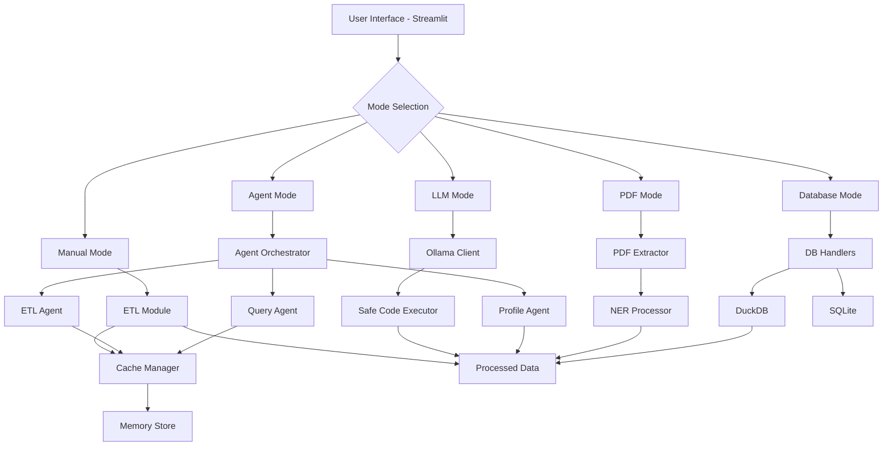

# 🤖 AutoPipelineAI v0.3.0

**LLM-Driven Agentic Framework for Autonomous ETL and DataOps**
Designed and built by [Nitesh Ranjan Singh](https://github.com/nitesh0007-edith)

---

## 🚀 Project Summary

**AutoPipelineAI** is a next-generation open-source framework combining **LLMs**, **autonomous agents**, and **modular ETL pipelines** to automate complex data workflows from ingestion to analysis — all running **locally** on your machine.

> 🧠 Ask questions. Upload files. Get data cleaned, analyzed, and summarized — autonomously.

### 🔑 Key Features (v0.3.0)

- ✅ **LLM-powered natural language querying** over CSV, PDF, and databases
- ✅ **Multi-agent orchestration** using LangChain and CrewAI
- ✅ **Autonomous ETL and data transformation** with specialized agents
- ✅ **PDF extraction with NER** using PyMuPDF and spaCy
- ✅ **Database support** for SQLite and DuckDB
- ✅ **Memory & caching layer** for performance optimization
- ✅ **Schema validation + auto-profiling** using `ydata-profiling`
- ✅ **Interactive Streamlit dashboard** with 5 modes of operation
- ✅ **Safe code execution** with sandbox environment
- ✅ **Configuration management** via .env files
- ✅ **Comprehensive test suite** with unit tests
- 🧱 Fully extensible Python codebase with **no cloud dependency**

---

## 🌟 What's New in v0.3.0

### 🎯 Major Enhancements

1. **Multi-Agent System**
   - `ETLAgent` - Specialized in data extraction, transformation, and loading
   - `QueryAgent` - Answers natural language questions using LLM
   - `ProfilingAgent` - Generates comprehensive data profiles
   - `AgentOrchestrator` - Routes tasks to appropriate agents

2. **Document Processing**
   - PDF text extraction
   - Table extraction from PDFs
   - Named Entity Recognition (NER)
   - Image extraction from documents

3. **Database Integration**
   - DuckDB for high-performance analytics
   - SQLite for lightweight storage
   - Direct CSV/Parquet reading
   - SQL query interface

4. **Memory & Caching**
   - In-memory and disk-based caching
   - Conversation history tracking
   - Session state management
   - Execution logging

5. **Enhanced UI**
   - 5 operational modes (Manual, LLM, Agent, PDF, Database)
   - Real-time Ollama connection checks
   - System statistics dashboard
   - Session export/import

6. **Developer Experience**
   - Configuration via environment variables
   - Comprehensive test suite
   - Better error handling
   - Detailed logging

---

## 🧱 Architecture Overview



---

## 📁 Project Structure

```
AutoPipelineAI/
├── main.py                      # Original Streamlit app
├── main_enhanced.py             # Enhanced app with all features
├── requirements.txt             # Python dependencies (with versions)
├── .env.template                # Configuration template
├── pytest.ini                   # Test configuration
│
├── src/
│   ├── __init__.py
│   ├── config.py               # Configuration management
│   │
│   ├── agents/                 # Multi-agent system
│   │   ├── __init__.py
│   │   ├── base_agent.py       # Base agent class
│   │   ├── etl_agent.py        # ETL operations
│   │   ├── query_agent.py      # Natural language queries
│   │   ├── profiling_agent.py  # Data profiling
│   │   └── orchestrator.py     # Agent coordination
│   │
│   ├── cache/                  # Caching & memory
│   │   ├── __init__.py
│   │   ├── cache_manager.py    # Disk/memory caching
│   │   └── memory_store.py     # Session state
│   │
│   ├── database/               # Database support
│   │   ├── __init__.py
│   │   ├── duckdb_handler.py   # DuckDB operations
│   │   └── sqlite_handler.py   # SQLite operations
│   │
│   ├── document/               # Document processing
│   │   ├── __init__.py
│   │   ├── pdf_extractor.py    # PDF extraction
│   │   └── ner_processor.py    # Named entity recognition
│   │
│   ├── etl/                    # ETL operations
│   │   ├── __init__.py
│   │   └── load_superstore.py  # Data loading & cleaning
│   │
│   ├── llm/                    # LLM utilities
│   │   ├── __init__.py
│   │   ├── ollama_client.py    # Ollama integration
│   │   ├── prompt_templates.py # Prompt engineering
│   │   └── code_executor.py    # Safe code execution
│   │
│   └── utils/                  # Utilities
│       ├── __init__.py
│       ├── profiling.py        # Data profiling
│       └── schema.py           # Schema validation
│
├── tests/                      # Unit tests
│   ├── __init__.py
│   ├── test_cache.py
│   ├── test_database.py
│   └── test_llm.py
│
├── data/                       # Data directories
│   ├── cache/                  # Cache storage
│   ├── database/               # Database files
│   ├── processed/              # Processed data
│   ├── reports/                # Profile reports
│   └── exports/                # Session exports
│
├── input_docs/                 # Input data files
└── logs/                       # Application logs
```

---

## 🛠️ Tech Stack

| Category | Technologies | Version |
|----------|-------------|---------|
| **Core Language** | Python | 3.10+ |
| **Web Framework** | Streamlit | >=1.30.0 |
| **Data Processing** | Pandas, PyArrow | >=2.0.0 |
| **Data Profiling** | ydata-profiling | >=4.6.0 |
| **LLM Integration** | OpenAI Client, LangChain | >=1.12.0 |
| **Agent Framework** | CrewAI, LangGraph | >=0.11.0 |
| **LLM Runtime** | Ollama | Latest |
| **Databases** | DuckDB, SQLite | >=0.9.0 |
| **Document Processing** | PyMuPDF, pdfplumber | >=0.10.0 |
| **NER** | spaCy | >=3.7.0 |
| **Caching** | diskcache, redis | >=5.0.0 |
| **Logging** | Loguru | >=0.7.0 |
| **Visualization** | Plotly, Altair | >=5.18.0 |
| **Testing** | pytest, unittest | Latest |

---

## 💻 Installation & Setup

### 1. Clone the Repository

```bash
git clone https://github.com/nitesh0007-edith/AutoPipelineAI.git
cd AutoPipelineAI
```

### 2. Create Virtual Environment

```bash
python3 -m venv venv
source venv/bin/activate  # On Windows: venv\Scripts\activate
```

### 3. Install Dependencies

```bash
pip install -r requirements.txt
```

### 4. Install Ollama (For LLM Features)

```bash
# macOS/Linux
curl -fsSL https://ollama.ai/install.sh | sh

# Start Ollama service
ollama serve

# Pull a model (in another terminal)
ollama pull llama3
ollama pull mistral
ollama pull phi3
```

### 5. Download spaCy Model (For NER)

```bash
python -m spacy download en_core_web_sm
```

### 6. Configure Environment (Optional)

```bash
# Copy template and customize
cp .env.template .env
# Edit .env with your preferences
```

### 7. Run the Application

```bash
# Original version
streamlit run main.py

# Enhanced version with all features
streamlit run main_enhanced.py
```

Access the app at: `http://localhost:8501`

---

## 🎮 Usage Guide

### Mode 1: Manual Mode 📊

**Purpose:** Traditional ETL with filters and dashboards

1. Load sample data or upload your own CSV/Excel file
2. Apply date range and region filters
3. Generate profile reports
4. Save processed data to database

**Use Cases:**
- Quick data exploration
- Filtered data exports
- Data quality checks

### Mode 2: LLM Mode 🧠

**Purpose:** Natural language queries on data

1. Ensure Ollama is running (check in sidebar)
2. Load a dataset
3. Select LLM model (llama3, mistral, phi3)
4. Ask questions in natural language
5. View LLM-generated insights and code execution results

**Example Questions:**
```
- "What are the top 10 products by sales?"
- "Show total profit by region for 2020"
- "Which category has the highest return rate?"
- "Calculate average discount by segment"
```

### Mode 3: Agent Mode 🤝

**Purpose:** Multi-agent workflow automation

1. Describe your workflow in natural language
2. AI plans and breaks down tasks
3. Multiple specialized agents execute tasks
4. View results from each agent

**Example Workflows:**
```
- "Load superstore data, filter for 2020,
   calculate sales by region, and generate a report"

- "Extract data from PDF, clean it,
   save to database, and create profile"

- "Query top products, analyze trends,
   and export to CSV"
```

### Mode 4: PDF Extraction 📄

**Purpose:** Extract data and entities from PDFs

1. Upload PDF file
2. Select extraction type:
   - Text extraction
   - Table extraction
   - Metadata extraction
   - Named Entity Recognition (NER)
   - Everything
3. View and export results

**Use Cases:**
- Invoice processing
- Report data extraction
- Entity extraction (names, dates, amounts)

### Mode 5: Database Mode 🗄️

**Purpose:** SQL queries on stored data

1. Choose database type (DuckDB or SQLite)
2. View available tables
3. Check table schemas and statistics
4. Run custom SQL queries
5. View results as DataFrames

**Features:**
- High-performance analytics with DuckDB
- Direct Parquet/CSV reading
- SQL interface

---

## 🧪 Running Tests

```bash
# Run all tests
pytest

# Run specific test file
pytest tests/test_cache.py

# Run with coverage
pytest --cov=src --cov-report=html

# Run with verbose output
pytest -v
```

---

## 📊 System Requirements

- **Python:** 3.10 or higher
- **RAM:** 4GB minimum, 8GB recommended
- **Disk Space:** 2GB for models and cache
- **OS:** macOS, Linux, or Windows
- **Ollama:** Required for LLM features

---

## 🔧 Configuration

Create a `.env` file from the template:

```bash
cp .env.template .env
```

Key configuration options:

```env
# Ollama Settings
OLLAMA_BASE_URL=http://localhost:11434
OLLAMA_DEFAULT_MODEL=llama3

# Database Paths
DUCKDB_PATH=data/database.duckdb
SQLITE_PATH=data/database.db

# Cache Settings
CACHE_TTL_SECONDS=3600
MAX_HISTORY=100

# Logging
LOG_LEVEL=INFO
```

---

## 🐛 Troubleshooting

### Ollama Connection Issues

```bash
# Check if Ollama is running
curl http://localhost:11434/api/tags

# Start Ollama
ollama serve

# Check available models
ollama list
```

### spaCy Model Missing

```bash
python -m spacy download en_core_web_sm
```

### Import Errors

```bash
# Reinstall dependencies
pip install --upgrade -r requirements.txt
```

### Permission Issues

```bash
# Ensure directories exist and are writable
mkdir -p data/cache data/processed data/reports logs
chmod -R 755 data logs
```

---

## 💡 Example Use Cases

### 1. Sales Analysis Workflow

```python
# Using Agent Mode
"Load the sales data, filter for Q4 2023,
 calculate top 10 products by revenue,
 and generate a profiling report"
```

### 2. Invoice Processing

```python
# Using PDF Mode
1. Upload invoice PDF
2. Extract tables
3. Extract entities (dates, amounts, vendors)
4. Save to database
```

### 3. Data Quality Check

```python
# Using Manual + LLM Mode
1. Load dataset in Manual Mode
2. Generate profile report
3. Switch to LLM Mode
4. Ask: "What are the data quality issues?"
```

### 4. Database Analytics

```python
# Using Database Mode
SELECT
    Region,
    SUM(Sales) as Total_Sales,
    AVG(Profit) as Avg_Profit
FROM processed_data
WHERE Year = 2023
GROUP BY Region
ORDER BY Total_Sales DESC
```

---

## 🗺️ Roadmap

### ✅ Completed (v0.3.0)
- [x] Multi-agent orchestration
- [x] PDF extraction with NER
- [x] Database support (DuckDB, SQLite)
- [x] Memory and caching layer
- [x] Enhanced UI with 5 modes
- [x] Configuration management
- [x] Unit tests
- [x] Safe code execution

### 🔜 Upcoming (v0.4.0)
- [ ] Docker containerization
- [ ] API endpoints (FastAPI)
- [ ] Web scraping capabilities
- [ ] Time series analysis
- [ ] Data visualization dashboard
- [ ] Email report generation
- [ ] Scheduled workflows
- [ ] Cloud storage integration (optional)

### 🚀 Future Ideas
- [ ] Integration with more LLM providers
- [ ] Support for more document formats
- [ ] Real-time data streaming
- [ ] Collaborative features
- [ ] CI/CD pipeline
- [ ] Auto-documentation generation

---

## 🤝 Contributing

Contributions are welcome! Here's how you can help:

1. **Fork the repository**
2. **Create a feature branch**
   ```bash
   git checkout -b feature/amazing-feature
   ```
3. **Make your changes**
4. **Add tests** for new features
5. **Commit your changes**
   ```bash
   git commit -m "Add amazing feature"
   ```
6. **Push to your fork**
   ```bash
   git push origin feature/amazing-feature
   ```
7. **Open a Pull Request**

### Development Guidelines

- Follow PEP 8 style guide
- Add docstrings to all functions
- Write unit tests for new features
- Update README for significant changes
- Use type hints where applicable

---

## 👨‍💻 Author

**Nitesh Ranjan Singh**
*Analyst (Data Engineer) @ IQVIA*
*Incoming MSc Data Science (University of Glasgow)*

- 🌐 [GitHub](https://github.com/nitesh0007-edith)
- 🔗 [LinkedIn](https://www.linkedin.com/in/nitesh0007/)
- 📧 Email: niteshranjan1996@gmail.com

---

## 🙏 Acknowledgments

- **Ollama** for local LLM runtime
- **LangChain** for agent framework
- **CrewAI** for multi-agent orchestration
- **Streamlit** for amazing UI framework
- **spaCy** for NER capabilities
- **DuckDB** for high-performance analytics

---

## 📄 License

This project is licensed under the [MIT License](LICENSE).

---

## ⭐ Star History

If you find this project useful, please consider giving it a star! ⭐

---

## 📝 Changelog

### v0.3.0 (Current)
- Added multi-agent orchestration system
- Implemented PDF extraction with NER
- Added database support (DuckDB, SQLite)
- Implemented memory and caching layer
- Enhanced UI with 5 operational modes
- Added configuration management
- Comprehensive test suite
- Improved error handling

### v0.2.0
- LLM integration with Ollama
- Natural language querying
- Data profiling
- Schema validation

### v0.1.0
- Initial release
- Basic ETL operations
- Streamlit UI
- CSV loading and filtering

---

**Built with ❤️ using Python, Streamlit, LangChain, and Ollama**
